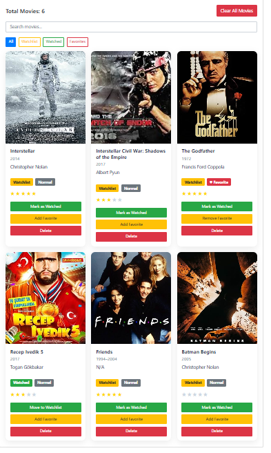
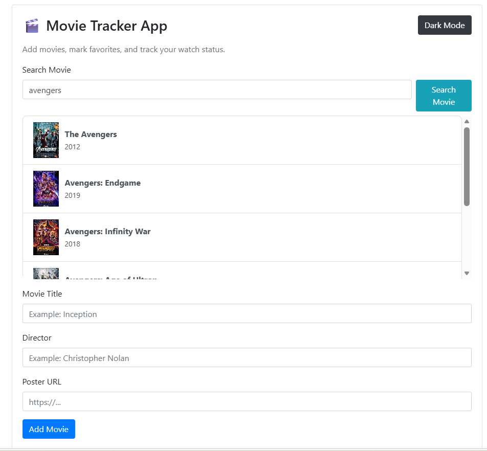

# 🎬 Movie Tracker App

A modern movie tracking application built with Vanilla JavaScript.  
Search movies via API, add them to your collection, mark favorites, and track your watch status.

---

## 🌐 Live Demo

👉 https://ekaytakli.github.io/movie-tracker-app/

---

## 🚀 Features

- 🔍 Search movies using OMDb API
- 📃 Select from multiple search results
- ➕ Add movies to your personal list
- ⭐ Rate movies (1–5 stars)
- ❤️ Mark as favorite
- 🎯 Watchlist / Watched system
- 🔎 Filter and search movies
- 💾 Data stored in LocalStorage
- 🌙 Dark mode support
- 📱 Responsive modern UI

---

## 🛠️ Technologies Used

- HTML5
- CSS3 (Flexbox & Grid)
- JavaScript (ES6+)
- OMDb API
- LocalStorage

---

## 📸 Screenshots

### 🏠 Main UI

### 🔍 Movie Search (API)

---

## 📂 Project Structure
